# Development of NER model for three low resource languages - Bhojpuri, Maithili and Magahi

This repository contains code for the NER on BMM languages done as part of course project for DS-605 Deep learning for low resource NLP at IIT Bhilai, Winter 2023.

### Background:
Named Entity Recognition (NER) is a critical natural language processing (NLP) task that involves identifying
and classifying entities, such as names of people, organizations,
locations, dates, and other domain-specific terms, within unstructured text. The primary goal of NER is to extract and
categorize these entities to provide a structured representation
of the information present in the text. NER plays a crucial
role in various downstream NLP applications like information
retrieval, question answering, fact-checking, summarization, and
machine translation. Bhojpuri, Maithili and Maghai are three
low-resource langugaes which are spoken in the Eastern part of
India. In this project we aim to develop a deep learning model
for the Named Entity Recognition of these three low resource
languages.

### BMM Dataset:
We have used a dataset created in the paper - [Development of a Dataset and a Deep Learning Baseline Named Entity Recognizer for Three Low Resource Languages: Bhojpuri, Maithili and Magahi](https://arxiv.org/pdf/2009.06451.pdf). As it is a copyrighted dataset, we have not added it to this repository. The dataset contains 16492, 9815 and 5320 sentences for each of the Bhojpuri,
Maithili and Magahi languages.

Below is the tags distribution of the dataset(with upper limit of 10,000):

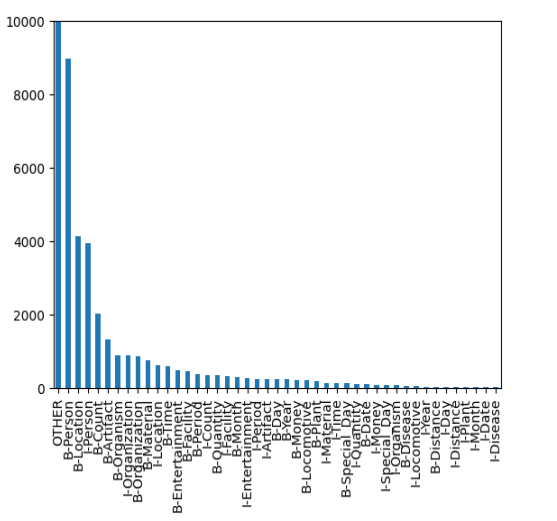

### Deep learning architectures used:
- **Hindi-BERT + MLP** - Intuition was that the script of Hindi and BMM languages is same, so a generalized model on Hindi would be a good to start with.
- **BiLSTM + CRF** - BiLSTM captures bothway information and CRFs are good at capturing dependencies between tags and words.
- **BiLSTM + CNN + CRF** - CNNs add the capability to extract finegrained character level information, thus enriching the model.
- **BiLSTM + + Attn + CRF** - Experimental decision, just to see if we get improved results, and we did.
- **Transformer + CNN + CRF** - Experimental decision, just to see if we get improved results, and we did.

### Evaluation metrics:
As the dataset we used was extremely imbalanced, using accuracy as an evaluation metric was not a good idea. So, we stuck to F1 score as the evaluation/comparison metric.

### Results:
To initially compare our model architectures and create quick prototypes, we considered training only for 15 epochs on a T4 Google Colab GPU notebook(this came in handy to use our copyrighted dataset from Google Drive).

Below is the training loss and F1 scores for 15 epochs(each model has CRF on top, hence not mentioned in figure).

Bhojpuri | Maithili | Magahi 
---------|----------|-------
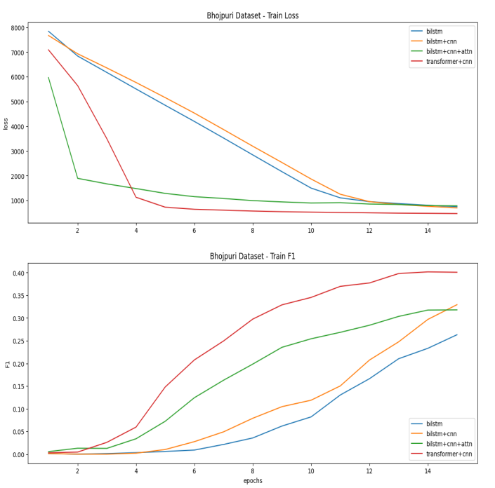 | 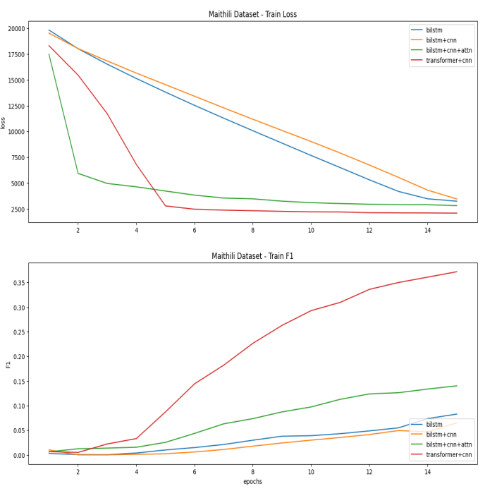 | 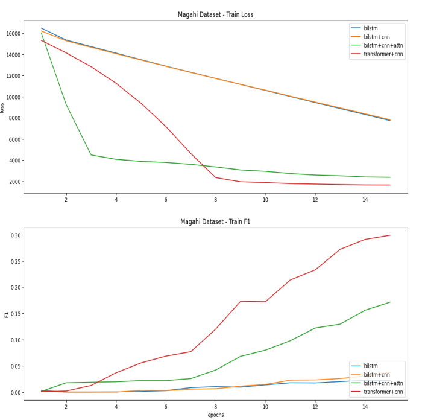

Below are the test F1 scores for the three languages for all models.

Bhojpuri | Maithili | Magahi 
---------|----------|-------
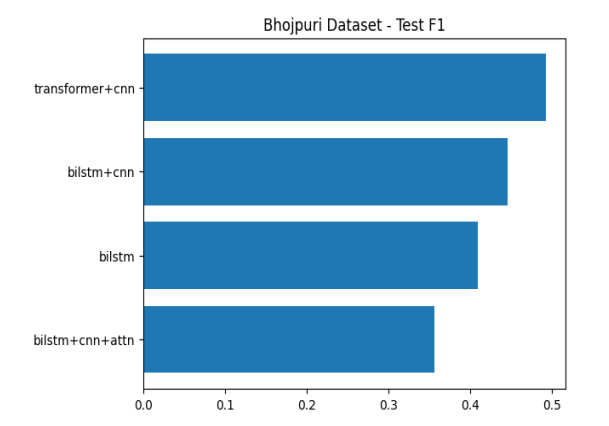 | 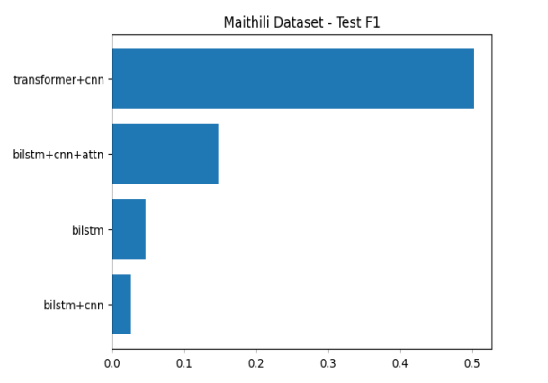 | 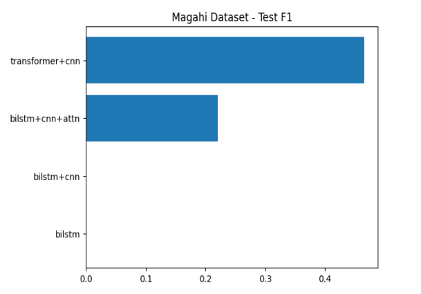

The best model turned out to be **Transformer + CNN + CRF**, so we trained it for 100 epochs on each dataset. Below is the train loss, test loss and train F1 score.
Bhojpuri | Maithili | Magahi 
---------|----------|-------
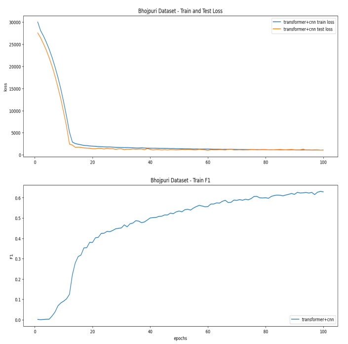 | 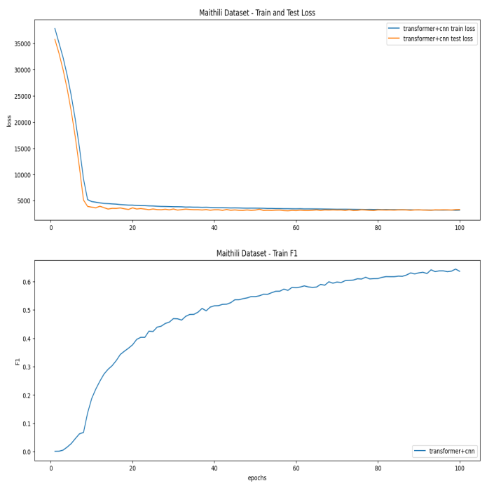 | 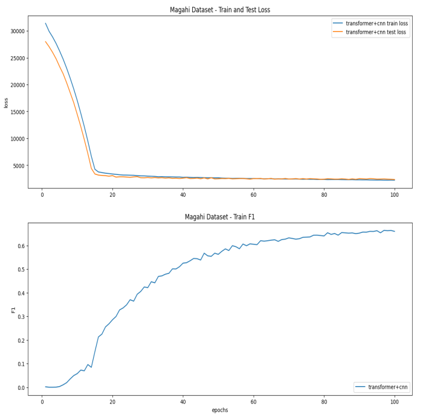

Final F1 scores for this best model on all datasets is as below,

Dataset | Test F1
--------|---------
Bhojpuri | 62.87
Maithili | 62.73
Magahi | 68.17
<!-- 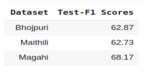 -->

### Final thoughts and future scope
- Compared to the paper which we referred the dataset from(which used LSTM + CNN + CRF), we could get a higher F1 score on the Bhojpuri dataset.
- We can think of using ensemble of such models for this task, which is expected to perform better.